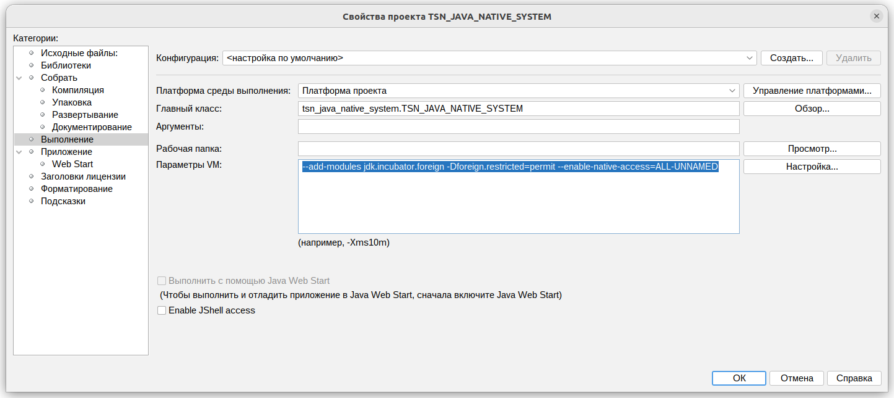
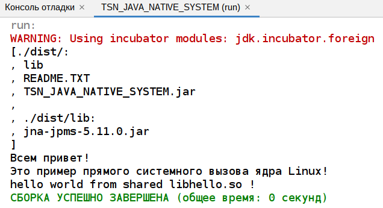

# TSN_JAVA_NATIVE_SYSTEM
Примеры нативной работы с операционной системой на Java в Linux


```
--enable-preview --add-modules jdk.incubator.foreign
```


```
--add-modules jdk.incubator.foreign -Dforeign.restricted=permit --enable-native-access=ALL-UNNAMED
```




https://github.com/java-native-access/jna

https://jdk.java.net/panama/17/
